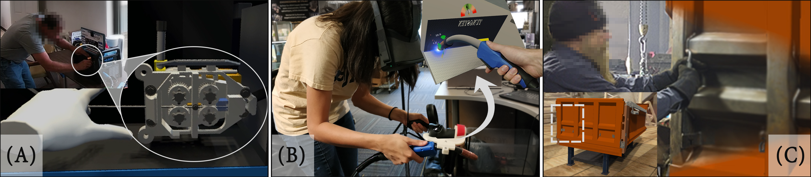

## About Me
I am currently a Ph.D candidate in the School of Mechanical Engineering at [Purdue University](https://purdue.edu/). As part of the [Convergence Design Lab](https://engineering.purdue.edu/cdesign/wp/), I am supervised by [Prof. Karthik Ramani](https://engineering.purdue.edu/~ramani/wordpress/featured-content/about/). I received my Master's degree in Mechanical Engineering from [Purdue University](https://purdue.edu/) in 2020. I received my Bachelors degree in Electronics and Communication Engineering at [NIT, Rourkela](https://www.nitrkl.ac.in/). My research focuses on the convergence of human factors, human-machine interaction design within the realm of engineering education, and psychology. I see new breakthroughs in computing technology, including Augmented Reality, Virtual Reality, robotics, and Artificial Intelligence, as promising avenues to enhance human capabilities and expertise while enriching their daily lives.

## Research Interests
- <strong>Human Computer Interaction:</strong> Virtual Reality (VR); Augmented Reality (AR); Robotics; Internet of Things
- <strong>Design and Prototyping:</strong> User Interface and Interaction Design; Embedded Systems
- <strong>User-Centered Design:</strong> Elicitation Study; Qualitative and Quantitative Evaluation; Statistical Analysis; Usability Research
- <strong>Instruction Design:</strong> Learning Theories, Pedagogical Reasearch, Skill Learning

### Selected Publications

[Towards Modeling of Virtual Reality Welding Simulators to Promote Accessible and Scalable Training](https://dl.acm.org/doi/abs/10.1145/3491102.3517696)

---

  
  

    <strong>Towards Modeling of Virtual Reality Welding Simulators to Promote Accessible and Scalable Training</strong>
    <a href="https://dl.acm.org/doi/abs/10.1145/3491102.3517696">Link to the Paper</a>
    <strong>Authors:</strong> Ananya Ipsita, Levi Erickson, Yangzi Dong, Joey Huang, Alexa K Bushinski, Sraven Saradhi, Ana M Villanueva, Kylie A Peppler, Thomas S Redick, Karthik Ramani
  

---
[The Design of a Virtual Prototyping System for Authoring Interactive VR Environments from Real World Scans](https://doi.org/10.1115/1.4062970)

Authors: Ananya Ipsita, Runlin Duan, Hao Li, Yuanzhi Cao, Min Liu, Alexander J Quinn, Karthik Ramani

---
[StoryMakAR: Bringing stories to life with an augmented reality & physical prototyping toolkit for youth](https://dl.acm.org/doi/abs/10.1145/3313831.3376790)

Authors: Terrell Glenn, Ananya Ipsita, Caleb Carithers, Kylie Peppler, Karthik Ramani

---
[StretchAR: Exploiting Touch and Stretch as a Method of Interaction for Smart Glasses using Wearable Straps](https://dl.acm.org/doi/abs/10.1145/3550305)

Authors: Luis Paredes, Ananya Ipsita, Juan C Mesa, Ramses V Martinez Garrido, Karthik Ramani

---
[ImpersonatAR: Using Embodied Authoring and Evaluation to Prototype Multi-Scenario Use cases for Augmented Reality Applications.](https://doi.org/10.1115/1.4063558)

Authors: Meng-Han Wu, Ananya Ipsita, Gaoping Huang, Karthik Ramani, Alexander J Quinn

---

### Conference Reviewing Experience

- <strong>Conference on Human Factors in Computing Systems (CHI):</strong> 2023 Papers, 2023 Late-Breaking Work, 2022 Papers, 2021 alt.chi
- <strong>Computer-Human Interaction in Play (CHI PLAY):</strong> 2022 Full Papers
- <strong>Computer-Supported Cooperative Work (CSCW):</strong> 2022 January 2022
- <strong>Designing Interactive Systems (DIS):</strong> 2022 Papers and Pictorials
- <strong>Engineering Interactive Computing Systems Proceedings of the ACM on Human-Computer Interaction (EICS PACM):</strong> 2022 Full Papers - Round 3
- <strong>Interaction Design and Children (IDC) Conference:</strong> 2022 Full & Short Papers
- <strong>IEEE International Symposium on Mixed and Augmented Reality (ISMAR):</strong> 2022 Conference Papers
- <strong>Nordic Conference on Human-Computer Interaction (NordiCHI):</strong> 2022 Papers

---

### Contact

- Address: 585 Purdue Mall, West Lafayette, IN 47907
- Office: Mechanical Engieering Building, Room 3164

---

---

Page template forked from <a href="https://github.com/evanca/quick-portfolio">evanca</a>

<!-- Remove above link if you don't want to attibute -->
